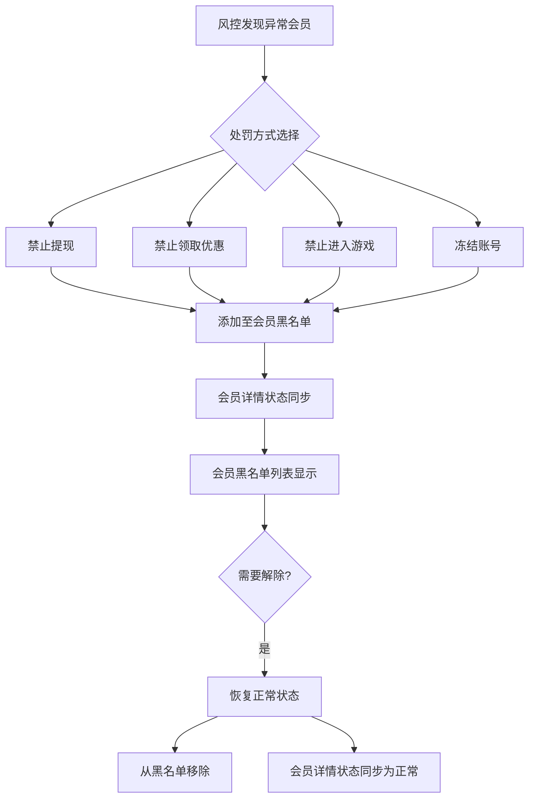
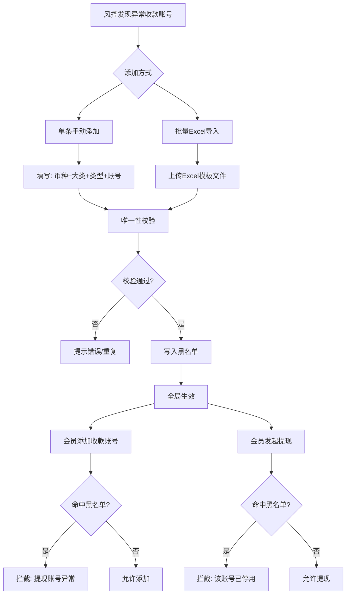

# PRD-020: 黑名单管理模块（Blacklist Management Module）

**状态：** 草稿  
**日期：** 2026-06-24  
**涉及仓库：** hashrace/platform-api、hashrace/platform-interface、hashrace/platform-admin-api、hashrace/platform-admin-interface  
**优先级：** P0（高）  
**作者：** bawan

## 1. 文档概览

- **产品名称：** HashRace Platform 风控系统
- **功能名称：** 黑名单管理模块
- **目标：** 通过多维度黑名单机制（会员黑名单、提现账号黑名单），实现对高风险用户和异常收款账号的精准管控，降低平台资金和运营风险。

## 2. 业务流程图

### 2.1 会员黑名单流程



### 2.2 提现账号黑名单流程



## 3. 功能详细需求

### 3.1 会员黑名单管理

#### 3.1.1 会员黑名单的本质

**关键理解：** 会员黑名单不是一个独立的黑名单列表，而是**会员账号状态的集合视图**。

- 会员黑名单列表展示的是所有账号状态为 "正常" 以外的会员
- 包含的异常状态：
  - 禁止提现
  - 禁止领取优惠
  - 禁止进入游戏
  - 冻结
  - 手动冻结
  - 其他平台定义的限制状态

**数据来源：** 会员系统的 `account_status` 字段

#### 3.1.2 添加会员黑名单

**入口位置：**
- 风控管理 > 会员黑名单 > 新增黑名单
- 会员管理 > 会员详情 > 账号状态修改

**必填字段：**
- 会员账号或会员ID（搜索选择）
- 限制类型（单选）：
  - 禁止提现
  - 禁止领取优惠
  - 禁止进入游戏
  - 冻结
- 备注（选填，最多200字符）

**业务规则：**
1. 同一会员只能有一个有效的限制状态（后设置的覆盖前设置的）
2. 添加成功后，会员账号状态立即生效
3. 会员在前台的相应功能立即受限
4. 系统记录操作人和操作时间

**通知机制：**
- 站内信：必发
- 邮件：若会员已绑定邮箱则发送
- 短信：若限制类型为 "冻结"，且已绑定手机号，则发送短信

#### 3.1.3 会员黑名单与会员详情的双向同步

**同步机制（核心规则）：**

| 操作入口 | 操作内容 | 同步结果 |
|---------|---------|---------|
| 会员黑名单 > 新增 | 限制类型=禁止提现 | 会员详情 > 账号状态 = 禁止提现 |
| 会员详情 > 修改状态 | 账号状态改为禁止提现 | 会员黑名单列表新增一条记录 |
| 会员黑名单 > 解除 | 移除该会员的限制 | 会员详情 > 账号状态 = 正常 |
| 会员详情 > 修改状态 | 账号状态改为正常 | 会员黑名单列表移除该会员记录 |

**实时性要求：**
- 两个入口的状态变更必须在 **1 秒内同步完成**
- 使用数据库事务保证一致性
- 同步失败必须回滚操作并提示用户

**状态映射关系：**
```
会员黑名单.限制类型 ⇄ 会员系统.account_status

禁止提现 ⇄ withdraw_forbidden
禁止领取优惠 ⇄ bonus_forbidden
禁止进入游戏 ⇄ game_forbidden
冻结 ⇄ frozen
正常 ⇄ normal（从黑名单移除）
```

#### 3.1.4 会员黑名单列表

**筛选条件：**
- 时间范围：操作时间（日/周/月快捷选择）
- 会员账号/会员ID：精准搜索
- 限制类型：下拉多选
- 操作人：文本搜索

**列表字段：**
- 会员ID（可点击跳转）
- 会员账号（可点击跳转）
- 币种
- 限制类型（标签展示）
- 备注
- 操作人
- 操作时间
- 操作：[解除限制] [修改备注]

**批量操作：**
- 批量解除限制（恢复正常）
- 批量修改限制类型
- 批量导出

#### 3.1.5 解除会员黑名单

**操作方式：**
- 方式1：会员黑名单列表 > 点击 [解除限制]
- 方式2：会员详情 > 账号状态改为 "正常"

**二次确认：**
- 弹窗提示："确认将该会员恢复为正常状态？"
- 要求填写解除原因（必填，≥10字符）

**解除后效果：**
- 会员账号状态立即变为 "正常"
- 该会员从会员黑名单列表移除
- 会员在前台的所有功能立即恢复
- 记录操作日志

**通知机制：**
- 站内信：必发，通知会员账号已恢复正常
- 邮件：若已绑定邮箱则发送

### 3.2 提现账号黑名单管理

#### 3.2.1 提现账号黑名单定位

**作用维度：** 账号级别（不是会员级别）

**作用范围：** 全局生效
- 任何会员都不能添加该收款账号
- 已绑定该账号的会员无法使用该账号提现
- 不影响会员的其他收款账号

**唯一键定义：**
```
币种 + 提现大类 + 类型名称 + 提现账号 = 唯一记录
```

**示例：**
- `CNY + 银行卡 + 银行卡转账 + 6222000000000000` → 1条唯一记录
- `CNY + 三方钱包 + 支付宝 + example@email.com` → 1条唯一记录

#### 3.2.2 单条添加提现账号黑名单

**入口位置：** 风控管理 > 黑名单 > 提现账号黑名单 > 新增

**必填字段：**
- 币种：下拉选择（CNY、USD、USDT、EUR等）
- 提现大类：下拉选择
  - 银行卡
  - 三方钱包
  - 数字货币
  - 数字人民币
- 类型名称：下拉选择（依提现大类联动）
  - 银行卡大类：银行卡转账
  - 三方钱包大类：支付宝、微信支付、汇旺支付
  - 数字货币大类：USDT-TRC20、USDT-ERC20、BTC、ETH
- 提现账号/地址：文本输入
  - 银行卡：16-19位数字
  - 支付宝/微信：手机号或邮箱
  - 数字货币：钱包地址
- 备注：选填（最多200字符）

**格式校验：**
- 币种、提现大类、类型名称必须在系统枚举值中
- 提现账号不能为空或纯空格
- 银行卡号必须通过Luhn算法校验
- 数字货币地址必须符合对应链的地址格式

**唯一性校验：**
- 提交前检查：币种 + 提现大类 + 类型名称 + 提现账号 是否已存在
- 若已存在，提示："该提现账号已在黑名单中"
- 若不存在，允许添加

**添加成功后：**
- 立即全局生效（无延迟）
- 记录创建人、创建时间
- Toast提示："添加成功"

#### 3.2.3 批量导入提现账号黑名单

**入口位置：** 风控管理 > 黑名单 > 提现账号黑名单 > 批量导入

**导入流程：**

1. 点击 [批量导入] 按钮
2. 下载Excel模板（模板包含示例数据行）
3. 按模板格式填写数据
4. 上传填写好的Excel文件
5. 系统自动校验
6. 显示导入结果

**Excel模板格式：**

| 列名 | 是否必填 | 格式说明 | 示例 |
|------|---------|---------|------|
| 币种 | 必填 | 文本，必须在系统枚举值中 | CNY |
| 提现大类 | 必填 | 文本，必须在系统枚举值中 | 银行卡 |
| 类型名称 | 必填 | 文本，必须在系统枚举值中 | 银行卡转账 |
| 提现账号/地址 | 必填 | 文本，不能为空 | 6222000000000000 |
| 备注 | 选填 | 文本，最多200字符 | 疑似洗钱账号 |

**批量校验规则：**
- 逐行校验格式和必填项
- 校验唯一性（与现有黑名单对比）
- 校验账号格式（银行卡/数字货币地址）
- 记录每行的校验结果（成功/失败/重复）

**导入结果展示：**
- 成功：X 条（写入黑名单）
- 失败：Y 条（格式错误/必填项缺失）
- 重复：Z 条（已存在，跳过）
- 提供下载"失败明细"Excel，包含失败原因

**Toast提示：**
- 全部成功："导入成功，共导入 X 条记录"
- 部分失败："导入完成，成功 X 条，失败 Y 条，重复 Z 条，点击下载失败明细"
- 全部失败："导入失败，请检查文件格式"

#### 3.2.4 提现账号黑名单列表

**筛选条件：**
- 币种：下拉选择（全部/CNY/USD等）
- 提现大类：下拉选择（全部/银行卡/三方钱包等）
- 类型名称：下拉选择（依提现大类联动）
- 提现账号：文本搜索（支持模糊查询）
- 创建时间范围：日期选择器

**列表字段：**
- 币种
- 提现大类
- 类型名称
- 提现账号/地址（完整显示，支持复制）
- 备注
- 创建人
- 创建时间
- 操作：[移除] [修改备注]

**批量操作：**
- 批量移除
- 批量导出

#### 3.2.5 移除提现账号黑名单

**操作方式：**
- 单条移除：列表 > 点击 [移除]
- 批量移除：勾选多条 > 点击底部 [批量移除]

**二次确认：**
- 单条移除："确认移除该提现账号？移除后任何会员都可使用该账号提现。"
- 批量移除："确认移除选中的 N 个提现账号？"

**移除后效果：**
- 立即从黑名单删除
- 会员可以立即添加该收款账号
- 已绑定该账号的会员可以立即使用该账号提现
- 记录操作日志

### 3.3 前台拦截规则详解

#### 3.3.1 提现账号黑名单前台拦截

**拦截点1：添加收款账号时**

**触发场景：**
- 前台：会员在"收款账户管理"页面添加新收款账号
- 后台：风控/客服在"会员详情"为会员添加提现账号

**拦截逻辑：**
```
用户提交 → 后台校验（币种+大类+类型+账号）
         → 在提现账号黑名单中查询
         → 若命中 → 返回错误码 + 错误文案
         → 若未命中 → 允许添加
```

**前台表现：**
- 红色Toast弹窗："提现账号异常，请联系客服！(error:BLACKLIST_001)"
- 账号不保存
- 表单保持当前填写状态（不清空）

**后台表现：**
- 同样的错误文案："提现账号异常，请联系客服！(error:BLACKLIST_001)"
- 不保存该账号

**拦截点2：发起提现申请时**

**触发场景：**
- 会员在前台提现申请页选择已绑定的收款账号
- 填写提现金额、提现密码
- 点击"确定提现"按钮

**账号展示阶段（不拦截）：**
- 进入提现申请页时，加载会员的所有收款账号
- 黑名单账号正常显示在列表中
- 账号项后显示**红色"停用"文字标识**
- 允许选中该账号
- 允许填写提现金额和密码

**提交阶段（拦截）：**
- 点击"确定提现" → 后台校验该账号是否在黑名单
- 若命中黑名单 → 拦截
- 前台红色Toast："该提现账号已被停用"
- 提现请求不提交

**设计意图（重要）：**
- 黑名单账号在前台仍可选中、可填写，只在最后提交时拦截
- 目的：记录会员的尝试行为，便于风控分析
- 这是**有意设计**，不是bug

#### 3.3.2 会员黑名单前台拦截

**拦截类型1：禁止提现**

**触发场景：**
- 会员账号状态 = "禁止提现"
- 会员在前台提现申请页操作

**界面表现（不拦截选择和填写）：**
- 提现申请页正常展示
- 所有提现方式和账号可选
- 提现金额、提现密码可填写
- "确定提现"按钮：表单填完后可点击

**提交阶段（拦截）：**
- 点击"确定提现" → 后台校验会员状态
- 若状态 = "禁止提现" → 拦截
- 前台红色Toast："账号已被禁止提现，请联系客服！"
- 提现请求不提交

**拦截类型2：禁止领取优惠**

**触发场景：**
- 会员账号状态 = "禁止领取优惠"
- 会员访问优惠活动页面或尝试领取优惠

**界面表现：**
- 优惠列表正常展示
- 优惠详情可查看
- 点击"领取"按钮 → 拦截
- 前台Toast："您暂时无法领取优惠，如有疑问请联系客服"

**拦截类型3：禁止进入游戏**

**触发场景：**
- 会员账号状态 = "禁止进入游戏"
- 会员点击游戏启动按钮

**界面表现：**
- 游戏列表正常展示
- 点击游戏 → 拦截
- 前台Toast："您暂时无法进入游戏，如有疑问请联系客服"

**拦截类型4：冻结**

**触发场景：**
- 会员账号状态 = "冻结"
- 会员登录或访问任何页面

**界面表现：**
- 登录后立即跳转至"账号冻结"提示页
- 显示："您的账号已被冻结，如有疑问请联系客服"
- 提供客服联系方式
- 会员无法进行任何操作（充值/提现/投注/领优惠等全部禁用）

### 3.4 拦截优先级和组合规则

**当多个拦截条件同时满足时，按以下优先级执行：**

| 优先级 | 拦截类型 | 影响范围 |
|-------|---------|---------|
| 1 | 会员冻结 | 全部功能 |
| 2 | 会员禁止提现 | 仅提现 |
| 3 | 提现账号黑名单 | 该账号的提现 |

**组合场景示例：**
- 会员被"禁止提现" + 使用黑名单账号提现
  - 优先拦截"会员禁止提现"
  - 提示："账号已被禁止提现，请联系客服！"
  
- 会员被"冻结" + 尝试任何操作
  - 所有功能全部禁用
  - 显示账号冻结页面

## 4. 页面原型设计（UI元素）

### 页面1：会员黑名单列表页

**顶部筛选区：**
- 时间快捷切换：[日] [周] [月]
- 日期时间范围：[起始时间] ~ [结束时间]
- 会员账号/ID：[输入框] + [搜索按钮]
- 限制类型：[下拉多选] 禁止提现/禁止领取优惠/禁止进入游戏/冻结
- 操作人：[输入框]
- [搜索] [重置] 按钮

**右上角功能区：**
- [新增黑名单] 按钮（主按钮）
- [批量导出] 按钮
- [刷新] 图标

**列表区域：**
- 表头：[全选] 会员ID | 会员账号 | 币种 | 限制类型 | 备注 | 操作人 | 操作时间 | 操作
- 数据行：复选框 + 各字段数据 + [解除限制] [修改备注] 按钮
- 限制类型以彩色标签展示：
  - 禁止提现：橙色
  - 禁止领取优惠：黄色
  - 禁止进入游戏：蓝色
  - 冻结：红色

**底部操作栏：**
- [全选当前页] 复选框
- 已选择 N 条数据 共 X 条
- [批量解除限制] 下拉按钮
- 分页控件

### 页面2：新增会员黑名单弹窗

**弹窗标题：** 新增会员黑名单

**表单字段：**
- 会员账号/ID：[搜索选择器]
  - 输入关键字后下拉显示匹配的会员列表
  - 显示：会员ID | 会员账号 | 币种
- 限制类型：[单选下拉]
  - 禁止提现
  - 禁止领取优惠
  - 禁止进入游戏
  - 冻结
- 备注：[文本域] 最多200字符，显示字数统计

**底部按钮：**
- [取消] [确定]（确定为主按钮）

**交互说明：**
- 会员账号/ID必选，否则确定按钮置灰
- 限制类型必选
- 点击确定后，若该会员已在黑名单中，提示"该会员已设置限制，是否覆盖？"

### 页面3：提现账号黑名单列表页

**顶部筛选区：**
- 币种：[下拉选择] 全部/CNY/USD/USDT等
- 提现大类：[下拉选择] 全部/银行卡/三方钱包/数字货币
- 类型名称：[下拉选择]（依大类联动）
- 提现账号：[输入框] 支持模糊查询
- 创建时间：[日期范围选择器]
- [搜索] [重置] 按钮

**右上角功能区：**
- [新增] 按钮
- [批量导入] 按钮（带下载模板链接）
- [批量导出] 按钮
- [刷新] 图标

**列表区域：**
- 表头：[全选] 币种 | 提现大类 | 类型名称 | 提现账号/地址 | 备注 | 创建人 | 创建时间 | 操作
- 数据行：复选框 + 各字段数据 + [复制] 图标（账号后） + [移除] [修改备注] 按钮
- 提现账号/地址字段：
  - 完整显示（不脱敏）
  - 鼠标悬停显示[复制]图标
  - 点击复制到剪贴板，Toast"复制成功"

**底部操作栏：**
- [全选当前页] 复选框
- 已选择 N 条数据 共 X 条
- [批量移除] 按钮
- 分页控件

### 页面4：新增提现账号黑名单弹窗

**弹窗标题：** 新增提现账号黑名单

**表单字段：**
- 币种：[下拉选择] 必填
  - CNY、USD、EUR、USDT、USDC等
- 提现大类：[下拉选择] 必填
  - 银行卡、三方钱包、数字货币、数字人民币
- 类型名称：[下拉选择] 必填（依提现大类联动）
  - 银行卡：银行卡转账
  - 三方钱包：支付宝/微信支付/汇旺支付
  - 数字货币：USDT-TRC20/USDT-ERC20/BTC/ETH
- 提现账号/地址：[输入框] 必填
  - Placeholder根据类型名称变化
  - 银行卡："请输入16-19位银行卡号"
  - 支付宝/微信："请输入手机号或邮箱"
  - 数字货币："请输入钱包地址"
- 备注：[文本域] 选填，最多200字符

**实时校验提示：**
- 提现账号格式错误时，输入框下方显示红色提示
- 银行卡：Luhn算法校验
- 数字货币：地址格式校验

**底部按钮：**
- [取消] [确定]（确定为主按钮）

**交互说明：**
- 所有必填项未填写时，确定按钮置灰
- 点击确定后，后台校验唯一性
- 若已存在，Toast"该提现账号已在黑名单中"
- 若不存在，添加成功，Toast"添加成功"

### 页面5：批量导入弹窗

**弹窗标题：** 批量导入提现账号黑名单

**步骤1：下载模板**
- 提示文案："请先下载Excel模板，按模板格式填写后上传"
- [下载模板] 链接按钮

**步骤2：上传文件**
- 上传区域（拖拽或点击上传）
- 支持格式：.xlsx .xls
- 文件大小限制：最大10MB

**步骤3：校验结果**
- 显示进度条："正在校验..."
- 校验完成后显示结果：
  - ✓ 成功：X 条
  - ✗ 失败：Y 条（[下载失败明细]）
  - ⚠ 重复：Z 条

**底部按钮：**
- [取消] [确认导入]（仅当有成功记录时可点击）

## 5. 异常处理与安全策略

| 异常场景 | 处理逻辑 |
|---------|---------|
| 添加会员黑名单时会员已在黑名单 | 提示"该会员已设置限制，是否覆盖？"，确认后覆盖原记录 |
| 添加提现账号黑名单时账号已存在 | 拦截，Toast"该提现账号已在黑名单中" |
| 批量导入Excel格式错误 | 返回具体错误行号和错误原因，提供下载失败明细 |
| 批量导入超过1000条 | 拦截，提示"单次最多导入1000条，请拆分后重试" |
| 会员黑名单与会员详情状态不一致 | 以会员系统account_status为准，黑名单列表实时同步 |
| 解除黑名单时会员状态已被其他操作修改 | 提示"会员状态已变更，请刷新后重试" |
| 移除提现账号黑名单时有会员正在使用该账号提现 | 允许移除，已提交的提现请求继续走原流程 |
| 前台拦截时后台服务异常 | 前台显示"系统繁忙，请稍后重试"，记录错误日志 |
| 管理员权限不足时访问黑名单页面 | 跳转403页面，提示"无权限访问" |

## 6. 后端与数据需求

> 本节描述对后端能力的硬性要求；具体技术方案在对应 Spec 中细化。

### 6.1 会员黑名单数据需求

- **数据来源：** 会员系统的 `account_status` 字段
- **不需要新建表：** 会员黑名单是 account_status 的视图，不单独存储
- **枚举值定义：**
  ```
  account_status ENUM:
  - normal（正常）
  - withdraw_forbidden（禁止提现）
  - bonus_forbidden（禁止领取优惠）
  - game_forbidden（禁止进入游戏）
  - frozen（冻结）
  ```
- **索引要求：** account_status 字段需要索引以支持快速查询

### 6.2 提现账号黑名单数据需求

- **新建表：** `withdrawal_account_blacklist`
- **唯一键：** (currency, category, type, account) 复合唯一索引
- **字段要求：**
  - currency: VARCHAR(10) NOT NULL（币种）
  - category: VARCHAR(50) NOT NULL（提现大类）
  - type: VARCHAR(50) NOT NULL（类型名称）
  - account: VARCHAR(200) NOT NULL（提现账号/地址）
  - remark: VARCHAR(200)（备注）
  - created_by: VARCHAR(50)（创建人）
  - created_at: TIMESTAMP（创建时间）
- **索引要求：**
  - 复合唯一索引：(currency, category, type, account)
  - 普通索引：account（支持模糊查询）
  - 普通索引：created_at（支持时间范围查询）

### 6.3 操作日志需求

- **日志记录范围：**
  - 会员黑名单：添加、解除、修改限制类型、修改备注
  - 提现账号黑名单：添加、移除、批量导入、修改备注
- **日志字段：**
  - 操作类型、操作对象（会员ID或账号）、操作前后值、操作人、操作时间、操作IP
- **保留期限：** 至少2年

### 6.4 拦截校验性能要求

- **提现账号黑名单校验：**
  - 查询响应时间 < 100ms
  - 支持高并发查询（缓存机制）
- **会员状态校验：**
  - 查询响应时间 < 50ms
  - 实时性要求高，不能有延迟

## 7. 验收标准（QA）

### 7.1 会员黑名单验收

- [ ] 在"会员黑名单"添加限制后，"会员详情"账号状态在1秒内同步
- [ ] 在"会员详情"修改状态后，"会员黑名单"列表在1秒内同步
- [ ] 解除会员黑名单后，会员账号状态立即变为"正常"
- [ ] 解除会员黑名单后，该会员从黑名单列表移除
- [ ] 设置"禁止提现"后，会员在前台点击"确定提现"被拦截，提示"账号已被禁止提现，请联系客服！"
- [ ] 设置"禁止领取优惠"后，会员点击领取优惠被拦截
- [ ] 设置"禁止进入游戏"后，会员点击游戏被拦截
- [ ] 设置"冻结"后，会员登录后立即跳转至账号冻结页面
- [ ] 添加会员黑名单时，站内信必发
- [ ] 添加会员黑名单（限制类型=冻结）且会员已绑定邮箱，邮件必发
- [ ] 批量解除会员黑名单，所有选中会员状态同步更新

### 7.2 提现账号黑名单验收

- [ ] 添加提现账号黑名单后，立即全局生效
- [ ] 前台添加收款账号时，命中黑名单账号被拦截，提示"提现账号异常，请联系客服！(error:xxx)"
- [ ] 后台为会员添加提现账号时，命中黑名单账号被拦截，提示与前台一致
- [ ] 前台提现申请页，黑名单账号显示红色"停用"标识
- [ ] 前台选择黑名单账号提现，可选中、可填写金额密码，点击"确定提现"时被拦截，提示"该提现账号已被停用"
- [ ] 移除提现账号黑名单后，前后台立即可添加该账号，已绑定该账号的会员立即可提现
- [ ] 唯一性校验生效：重复添加相同账号被拦截，提示"该提现账号已在黑名单中"
- [ ] 批量导入Excel，全部成功时Toast"导入成功，共导入 X 条"
- [ ] 批量导入Excel，部分失败时Toast"导入完成，成功 X 条，失败 Y 条，重复 Z 条"，提供下载失败明细
- [ ] 批量导入格式校验：必填项缺失、币种不在枚举值中、账号格式错误，均被拦截并记录失败原因
- [ ] 批量导入超过1000条时被拦截，提示"单次最多导入1000条"

### 7.3 权限与安全验收

- [ ] 无"黑名单管理"权限的管理员无法访问黑名单页面
- [ ] 无"新增黑名单"权限的管理员看不到[新增]按钮
- [ ] 无"移除黑名单"权限的管理员看不到[移除]按钮
- [ ] 所有操作记录日志，包含操作人、操作时间、操作IP
- [ ] 日志可追溯2年内的所有黑名单变更记录

---

## 附录A：与现有PRD的关系

本PRD（PRD-002 黑名单管理模块）与 PRD-001（资金密码）是**相互独立但协同工作**的两个模块：

| 关系类型 | 说明 |
|---------|------|
| **独立性** | 黑名单模块不依赖资金密码功能，资金密码功能也不依赖黑名单 |
| **协同点** | 提现拦截时，先校验会员黑名单，再校验资金密码 |
| **优先级** | 会员被"禁止提现"时，不进入资金密码校验环节（已在黑名单层被拦截） |

**拦截顺序（提现场景）：**
```
会员点击"确定提现"
  ↓
1. 校验会员状态（黑名单）
  ├─ 若"禁止提现" → 拦截，提示"账号已被禁止提现"
  └─ 若正常 → 继续
  ↓
2. 校验提现账号（黑名单）
  ├─ 若命中黑名单 → 拦截，提示"该提现账号已被停用"
  └─ 若未命中 → 继续
  ↓
3. 校验资金密码（PRD-001）
  ├─ 若未设置 → 引导设置
  ├─ 若错误 → 提示错误，计数
  └─ 若正确 → 继续
  ↓
4. 进入提现确认流程
```

---

**文档版本：** v1.0  
**最后更新：** 2026-06-24
