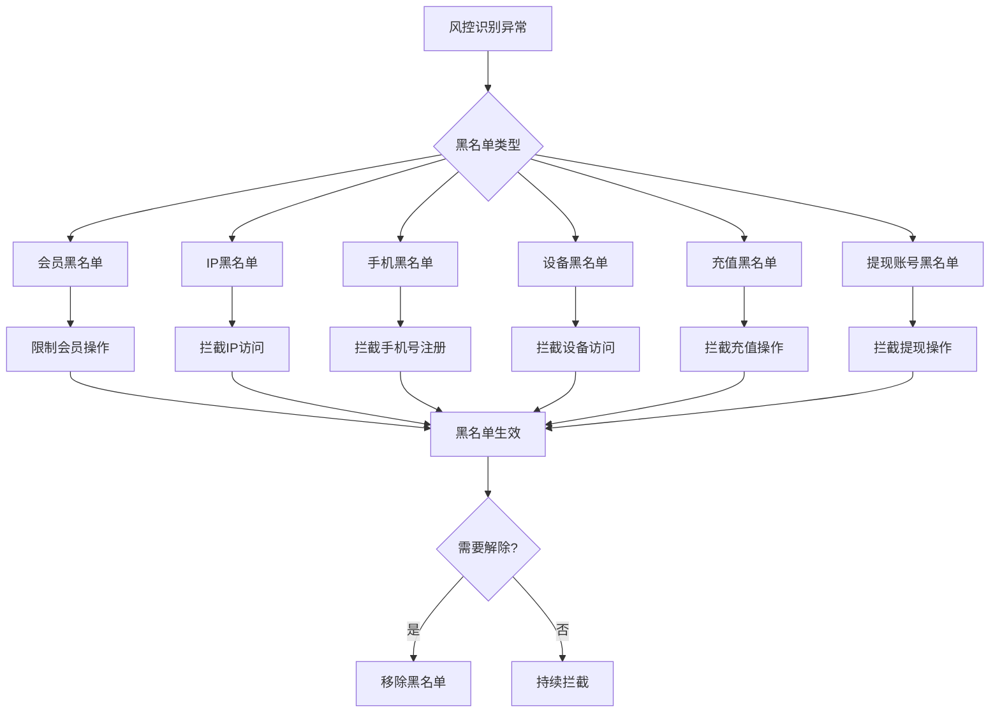

# PRD-020: 黑名单管理模块（Blacklist Management Module）

**状态：** 草稿  
**日期：** 2026-06-24  
**涉及仓库：** hashrace/platform-api、hashrace/platform-interface、hashrace/platform-admin-api、hashrace/platform-admin-interface  
**优先级：** P0（高）  
**作者：** bawan

## 1. 文档概览

- **产品名称：** HashRace Platform 风控系统
- **功能名称：** 黑名单管理模块
- **目标：** 通过6维度黑名单机制，实现对高风险用户、异常设备、异常收款账号的全方位精准管控，降低平台资金和运营风险。

### 1.1 六大黑名单类型

| 黑名单类型 | 封禁维度 | 主要功能 |
|-----------|---------|---------|
| 会员黑名单 | 会员账号 | 封禁会员账号，限制登录、提现、游戏、优惠等操作 |
| IP黑名单 | IP地址 | 封禁IP地址，阻止该IP访问平台或注册新账号 |
| 手机黑名单 | 手机号码 | 封禁手机号，阻止使用该手机号注册或绑定账号 |
| 设备黑名单 | 设备ID | 封禁设备指纹，阻止该设备访问平台 |
| 充值黑名单 | 充值账号 | 封禁充值支付账号，阻止使用该账号充值 |
| 提现账号黑名单 | 提现收款账号 | 封禁提现收款账号，阻止提现到该账号 |

## 2. 业务流程图

## 3. 功能详细需求

### 3.1 会员黑名单

#### 3.1.1 功能说明
封禁会员账号，限制登录、提现、游戏、优惠等操作。会员黑名单展示所有账号状态为"正常"以外的会员。

#### 3.1.2 列表字段
- 会员ID
- 会员账号
- 真实姓名
- 币种
- 充值次数
- 充值金额
- 充提差额
- 提现次数
- 提现金额
- 总余额
- 利息宝
- 状态（禁止提现/禁止优惠/禁止游戏/冻结）
- 注册IP地址
- 备注
- 操作（解除/修改备注）
- 操作人
- 操作时间

#### 3.1.3 操作功能
- **添加黑名单**：搜索会员账号/ID，选择限制类型（禁止提现/禁止优惠/禁止游戏/冻结），填写备注
- **解除黑名单**：恢复会员正常状态
- **修改备注**：更新备注信息
- **批量导出**：导出Excel

### 3.2 IP黑名单

#### 3.2.1 功能说明
封禁IP地址，阻止该IP访问平台或注册新账号。

#### 3.2.2 列表字段
- ID
- IP地址
- 限制类型（禁止访问/禁止注册）
- 关联账号数
- 备注
- 操作（删除/修改备注）
- 操作人
- 操作时间

#### 3.2.3 操作功能
- **添加IP黑名单**：输入IP地址，选择限制类型，填写备注
- **删除IP黑名单**：移除IP封禁
- **修改备注**：更新备注信息
- **批量导入**：上传Excel批量添加
- **批量导出**：导出Excel

### 3.3 手机黑名单

#### 3.3.1 功能说明
封禁手机号，阻止使用该手机号注册或绑定账号。

#### 3.3.2 列表字段
- ID
- 手机号
- 区号
- 关联账号数
- 备注
- 操作（删除/修改备注）
- 操作人
- 操作时间

#### 3.3.3 操作功能
- **添加手机黑名单**：输入手机号、区号，填写备注
- **删除手机黑名单**：移除手机号封禁
- **修改备注**：更新备注信息
- **批量导入**：上传Excel批量添加
- **批量导出**：导出Excel

### 3.4 设备黑名单

#### 3.4.1 功能说明
封禁设备指纹，阻止该设备访问平台。

#### 3.4.2 列表字段
- ID
- 设备号（设备指纹）
- 限制类型（禁止访问/禁止注册）
- 关联账号数
- 备注
- 操作（删除/修改备注）
- 操作人
- 操作时间

#### 3.4.3 操作功能
- **添加设备黑名单**：输入设备号，选择限制类型，填写备注
- **删除设备黑名单**：移除设备封禁
- **修改备注**：更新备注信息
- **批量导入**：上传Excel批量添加
- **批量导出**：导出Excel

### 3.5 充值黑名单

#### 3.5.1 功能说明
封禁充值支付账号，阻止使用该账号充值。

#### 3.5.2 列表字段
- 会员ID
- 会员账号
- 币种
- 充值次数
- 充值金额
- 总余额
- 注册IP地址
- 备注
- 操作（解除/修改备注）
- 操作人
- 操作时间

#### 3.5.3 操作功能
- **添加充值黑名单**：搜索会员账号/ID，填写备注
- **解除充值黑名单**：移除充值限制
- **修改备注**：更新备注信息
- **批量导出**：导出Excel

### 3.6 提现账号黑名单

#### 3.6.1 功能说明
封禁提现收款账号，阻止提现到该账号。会员添加收款账号或发起提现时，系统自动校验是否命中黑名单。

#### 3.6.2 列表字段
- ID
- 币种
- 提现大类（银行卡/数字货币/电子钱包等）
- 类型名称（具体支付方式）
- 提现账号/地址
- 备注
- 操作（删除/修改备注）
- 操作人
- 操作时间

#### 3.6.3 操作功能
- **单条添加**：选择币种、提现大类、类型名称，输入账号/地址，填写备注
- **批量导入**：下载Excel模板，批量上传
- **删除账号**：移除黑名单
- **修改备注**：更新备注信息
- **批量导出**：导出Excel

## 4. 业务规则

### 4.1 通用规则

**规则1：唯一性校验**
- 每个黑名单类型内，封禁目标（会员ID/IP/手机号/设备号/提现账号）不可重复
- 添加时自动校验，重复则提示"该记录已存在"

**规则2：操作日志**
- 所有添加、删除、修改操作记录操作人和操作时间
- 日志保留1年

**规则3：权限控制**
- 添加/删除黑名单：需"黑名单管理"权限
- 查看黑名单：需"黑名单查看"权限

### 4.2 会员黑名单规则

**规则1：状态同步**
- 会员黑名单列表数据来源于会员系统的 account_status 字段
- 添加会员黑名单 = 修改会员账号状态
- 解除会员黑名单 = 恢复会员账号状态为"正常"

**规则2：多状态支持**
- 同一会员可同时拥有多个限制状态（如：禁止提现+禁止优惠）

### 4.3 IP黑名单规则

**规则1：IP格式校验**
- 支持IPv4格式：xxx.xxx.xxx.xxx
- 支持CIDR格式：xxx.xxx.xxx.xxx/xx

**规则2：生效范围**
- 禁止访问：该IP无法访问平台任何页面
- 禁止注册：该IP无法注册新账号，但已有账号可正常使用

### 4.4 手机黑名单规则

**规则1：手机号格式**
- 区号+手机号组合校验
- 支持国际区号

**规则2：生效范围**
- 该手机号无法注册新账号
- 该手机号无法绑定到其他账号

### 4.5 设备黑名单规则

**规则1：设备指纹**
- 设备号由前端SDK生成，包含浏览器指纹、硬件信息等

**规则2：生效范围**
- 禁止访问：该设备无法访问平台
- 禁止注册：该设备无法注册新账号

### 4.6 充值黑名单规则

**规则1：生效范围**
- 该会员无法使用任何充值方式充值

### 4.7 提现账号黑名单规则

**规则1：拦截时机**
- 会员添加收款账号时校验，命中则提示"该账号已停用"
- 会员发起提现时校验，命中则拦截并提示"提现账号异常"

**规则2：Excel导入格式**
- 必填列：币种、提现大类、类型名称、提现账号/地址
- 选填列：备注

## 5. 异常处理与安全策略

| 异常场景 | 处理逻辑 |
|---------|---------|
| 添加重复记录 | 提示"该记录已存在"，不允许重复添加 |
| 批量导入格式错误 | 返回错误行号和错误原因，导入失败 |
| 批量导入部分成功 | 成功的记录写入，失败的记录返回错误列表 |
| 解除黑名单失败 | 回滚状态，提示"操作失败，请重试" |
| 权限不足 | 提示"无权限操作"，跳转403页面 |
| IP格式错误 | 提示"IP格式错误，请检查" |
| 手机号格式错误 | 提示"手机号格式错误，请检查" |

## 6. 数据与性能要求

### 6.1 数据量预估
- 会员黑名单：约1000-5000条
- IP黑名单：约500-2000条
- 手机黑名单：约300-1000条
- 设备黑名单：约200-800条
- 充值黑名单：约100-500条
- 提现账号黑名单：约500-2000条

### 6.2 性能要求
- 列表加载时间：< 3秒
- 黑名单校验时间：< 100ms
- 批量导入1000条：< 30秒

### 6.3 监控告警
- 黑名单校验失败率 > 1%：发送告警
- 批量导入失败率 > 10%：发送告警

## 7. 验收标准（QA）

### 7.1 会员黑名单验收
- [ ] 列表正确显示所有非正常状态的会员
- [ ] 添加会员黑名单后状态立即生效
- [ ] 解除会员黑名单后状态恢复正常
- [ ] 修改备注功能正常
- [ ] 导出Excel格式正确

### 7.2 IP黑名单验收
- [ ] 添加IP黑名单后立即生效
- [ ] 禁止访问类型：该IP无法访问平台
- [ ] 禁止注册类型：该IP无法注册新账号
- [ ] 删除IP黑名单后立即解除
- [ ] 批量导入功能正常
- [ ] IP格式校验正确

### 7.3 手机黑名单验收
- [ ] 添加手机黑名单后立即生效
- [ ] 该手机号无法注册新账号
- [ ] 该手机号无法绑定到其他账号
- [ ] 删除手机黑名单后立即解除
- [ ] 批量导入功能正常
- [ ] 手机号格式校验正确

### 7.4 设备黑名单验收
- [ ] 添加设备黑名单后立即生效
- [ ] 禁止访问类型：该设备无法访问平台
- [ ] 禁止注册类型：该设备无法注册新账号
- [ ] 删除设备黑名单后立即解除
- [ ] 批量导入功能正常

### 7.5 充值黑名单验收
- [ ] 添加充值黑名单后立即生效
- [ ] 该会员无法使用任何充值方式充值
- [ ] 解除充值黑名单后立即恢复
- [ ] 修改备注功能正常

### 7.6 提现账号黑名单验收
- [ ] 单条添加功能正常
- [ ] 批量导入功能正常，格式校验正确
- [ ] 会员添加收款账号时命中黑名单则拦截
- [ ] 会员发起提现时命中黑名单则拦截
- [ ] 删除黑名单后立即解除
- [ ] 唯一性校验正确，不允许重复添加

### 7.7 通用验收
- [ ] 所有操作记录日志
- [ ] 权限控制生效
- [ ] 批量导出功能正常
- [ ] 所有异常场景处理正确

---

**文档版本：** v2.0  
**最后更新：** 2026-06-24  
**更新说明：** 扩展为6个黑名单类型，覆盖会员、IP、手机、设备、充值、提现账号等维度
