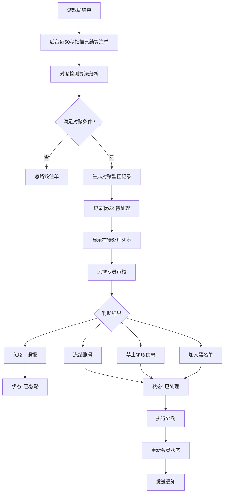

# PRD-021: 对赌监控模块（Hedging Monitoring Module）

**状态：** 草稿  
**日期：** 2026-06-24  
**涉及仓库：** hashrace/platform-api、hashrace/platform-admin-api、hashrace/platform-admin-interface  
**优先级：** P0（高）  
**作者：** bawan

## 1. 文档概览

- **产品名称：** HashRace Platform 风控系统
- **功能名称：** 对赌监控模块
- **目标：** 通过实时分析游戏注单数据，自动识别在同一游戏局中进行对冲投注的可疑会员组合，防止利用平台优惠进行对赌套利行为。

## 2. 业务流程图



## 3. 功能详细需求

### 3.1 对赌监控的业务定义

**什么是对赌：**
两个或多个会员在同一游戏局中进行对冲投注，一方盈利另一方亏损金额接近，目的是套取平台优惠或洗钱。

**典型对赌特征：**
- 登录时间接近（同一时间段）
- 使用相同或相近IP地址
- 在同一局游戏/赛事中投注
- 投注金额接近
- 盈亏互相抵消（A盈利≈B亏损）

### 3.2 对赌检测规则

#### 3.2.1 体育游戏对赌规则

**检测条件（需满足3项以上）：**
1. 登录时间相差 < 30 分钟
2. 使用相同 IP 地址登录
3. 投注时间相差 < 30 分钟
4. 投注同一赛事 ID
5. 投注金额相距 10% 以内
6. A 会员盈利金额 ≈ B 会员亏损金额（金额相距 10% 以内）

**配对逻辑：**
- 若同时满足条件的会员 > 2 人，选择盈亏金额最接近的一对
- 生成一条对赌监控记录

**示例场景：**
```
赛事: 曼联 vs 利物浦
会员A: 投注曼联赢 1000元，盈利 900元
会员B: 投注利物浦赢 1000元，亏损 1000元
判定: 满足对赌条件（同赛事 + 金额接近 + 盈亏互抵）
```

#### 3.2.2 电竞游戏对赌规则

**检测条件（需满足3项以上）：**
1. 登录时间相差 < 10 分钟
2. 使用相同 IP 地址
3. 投注时间相差 < 10 分钟
4. 投注同一 MAP ID
5. 投注金额相距 10% 以内
6. A 会员盈利金额 ≈ B 会员亏损金额（金额相距 10% 以内）

**电竞特点：**
- 时间窗口更短（10分钟 vs 体育30分钟）
- 按 MAP 维度匹配（而非整场比赛）

#### 3.2.3 真人游戏对赌规则

**检测条件（需满足3项以上）：**
1. 登录时间相差 < 10 分钟
2. 使用相同 IP 地址
3. 投注时间相差 < 10 分钟
4. 投注同一局（桌号 + 局号）
5. 投注金额相距 10% 以内
6. A 会员盈利金额 ≈ B 会员亏损金额（金额相距 8% 以内）

**真人特点：**
- 盈亏相距阈值更严格（8% vs 10%）
- 按具体一局匹配（非整个游戏）

### 3.3 自动检测机制

**检测频率：** 每 60 秒执行一次

**检测流程：**
1. 系统从注单数据库拉取最近 60 秒内已结算的注单
2. 按游戏类型（体育/电竞/真人）分类
3. 对每类注单运行对应的对赌检测算法
4. 配对符合条件的会员组合
5. 生成对赌监控记录，状态为"待处理"

**数据来源：** 游戏平台的注单系统（已结算注单）

### 3.4 页面功能设计

#### 3.4.1 待处理页签

**功能定位：** 展示所有新检测到的、尚未审核的对赌告警

**筛选条件：**
- 时间维度切换：日/周/月（默认：日）
- 起始/结束时间：日期时间选择器
- 币种：下拉选择（CNY、USD等）
- 游戏分类：棋牌/真人/体育/电竞/彩票等
- 游戏平台：依分类联动加载对应平台
- 账号类型：会员账号/会员ID
- 账号关键字：文本输入
- 同局场次范围：最低~最高（数字输入）

**列表字段：**
- [勾选框] 用于批量操作
- **会员1信息：**
  - 品牌名称(ID)
  - 币种
  - 游戏类型
  - 平台名称
  - 子游戏名称
  - 会员ID（可点击跳转）
  - 会员账号（可点击跳转）
  - 有效投注
  - 盈亏（正数绿色、负数红色）
- **会员2信息：** 同上
- 同局场数
- 触发时间
- 状态：未处理（橙色标签）
- 备注：空
- 操作：[处理] [详情]

**单条处理操作：**
1. 点击 [处理] 按钮
2. 弹出处理弹窗
3. 选择需要处理的会员：会员1 / 会员2 / 两者都处理
4. 选择处理类型：
   - **忽略**：标记为误报，不执行处罚
   - **冻结**：账号冻结，无法登录
   - **禁止领取优惠**：不能参与优惠活动
   - **加入黑名单**：最严格限制
5. 填写备注（选填，0-50字符）
6. 确认后执行

**批量处理操作：**
1. 勾选多条记录
2. 点击底部 [批量操作▾]
3. 选择"批量处理"
4. 统一选择处理类型、会员账号、备注
5. 确认后批量执行

**详情查看：**
点击 [详情] 查看完整游戏信息（只读）：
- 会员1和会员2的详细投注信息
- 游戏局号、赛事信息
- 投注时间、结算时间
- 投注金额、有效投注、盈亏

**导出功能：**
- 按当前筛选条件导出所有待处理记录
- 格式：Excel/CSV

**提醒设置：**
- 提醒方式：站内信/邮件
- 提醒条件：同局场次 ≥ N 次

#### 3.4.2 已处理页签

**功能定位：** 展示所有已执行处罚（冻结/禁止优惠/黑名单）的记录

**筛选条件：** 同"待处理"，额外增加：
- 处理结果：下拉选择（全部/冻结/禁止领取优惠/黑名单）
- 操作人：文本输入

**列表字段：** 同"待处理"，额外显示：
- 状态：已处理（绿色标签）
- 处理结果：冻结/禁止领取优惠/黑名单
- 操作人
- 操作时间
- 操作：[修改] [详情]

**修改处理操作：**
1. 点击 [修改] 按钮
2. 可以：
   - 切换处理结果（在冻结/禁止优惠/黑名单之间切换）
   - 撤销回待处理（清空所有处理信息）
   - 修改备注
3. 确认后执行

**批量修改：**
- 支持批量变更处理结果
- 支持批量撤销

#### 3.4.3 已忽略页签

**功能定位：** 展示所有标记为误报、不执行处罚的记录

**筛选条件：** 同"已处理"

**列表字段：** 同"已处理"，处理结果显示为"忽略"

**操作功能：** 同"已处理"

#### 3.4.4 全部页签

**功能定位：** 综合视图，展示所有状态的记录

**筛选条件：** 同"已处理"，额外增加：
- 状态：全部/未处理/已处理/已忽略

**操作功能：**
- 未处理记录：显示 [处理] 按钮
- 已处理/已忽略记录：显示 [修改] 按钮
- 批量操作：仅对已处理/已忽略记录生效，未处理记录自动跳过
- 不支持批量处理（需在"待处理"页签操作）

### 3.5 业务规则

#### 3.5.1 自动检测规则

**规则1：数据来源要求**
- 只检测已结算的注单（状态=已结算）
- 只检测最近60秒内结算的注单
- 忽略取消、和局等非正常结算的注单

**规则2：配对逻辑**
- 同一对会员在同一局只生成一条记录
- 同一对会员在不同局产生的对赌，生成不同记录
- 若>2人同时满足条件，选择盈亏金额最接近的一对

**规则3：触发阈值可配置**
- 金额相距百分比（默认10%，可调整为5%-20%）
- 盈亏相距百分比（体育/电竞10%，真人8%，可调整）
- 时间窗口（体育30分钟，电竞/真人10分钟，可调整）

#### 3.5.2 人工审核规则

**规则1：处罚执行**
- 忽略：不执行任何处罚，仅标记为已忽略
- 冻结：会员账号立即冻结，无法登录
- 禁止领取优惠：会员无法参与任何优惠活动
- 黑名单：加入会员黑名单，受最严格限制

**规则2：处罚可逆**
- 所有处罚都可以撤销
- 撤销后会员状态立即恢复
- 撤销会清空处理结果、操作人、操作时间、备注

**规则3：批量操作限制**
- 单次批量处理最多200条记录
- 超过限制需拆分多次操作

#### 3.5.3 通知规则

**会员通知：**
- 站内信：所有处罚必发
- 邮件：若会员已绑定邮箱则发送
- 短信：若处罚类型为"冻结"且已绑定手机号，则发送

**风控人员通知：**
- 待处理数量 > 阈值时，发送站内信/邮件提醒
- 提醒频率可配置（每30秒/60秒）

### 3.6 页面原型设计（UI元素）

#### 页面1：待处理列表页

**顶部筛选区：**
- 时间快捷切换：`[日] [周] [月]`
- 日期时间范围：`[起始时间] ~ [结束时间]`
- 币种：`[下拉选择] CNY`
- 游戏分类：`[下拉选择] 请选择分类`
- 游戏平台：`[下拉选择] 请选择平台` (依分类联动)
- 账号类型：`[下拉选择] 会员账号`
- 账号关键字：`[输入框]`
- 同局场次：`[最低] ~ [最高]`
- `[搜索] [重置]` 按钮

**右上角功能区：**
- `[操作教程]` 文字链接
- `[提醒设置]` 按钮
- `[导出]` 按钮
- `[刷新]` 图标

**列表区域：**
- 表头：`[全选]` | 会员1信息 | 会员2信息 | 同局场数 | 触发时间 | 状态 | 备注 | 操作
- 会员信息展示：
  - 品牌、币种、游戏类型、平台、子游戏（第一行）
  - 会员ID、会员账号、投注、盈亏（第二行）
- 盈亏数字颜色：正数绿色、负数红色
- 状态标签：橙色"未处理"
- 操作列：`[处理] [详情]`

**底部操作栏：**
- `[全选当前页]` 复选框
- 已选择 N 条数据 共 X 条
- `[批量操作 ▾]` 下拉按钮
  - 批量处理
  - 批量导出选中
- 分页控件

#### 页面2：处理弹窗

**弹窗标题：** 处理对赌监控

**表单字段：**
- 会员账号（多选勾选框）：
  - `☑ 会员1: tilly001`
  - `☑ 会员2: tilly002`
  - 默认两者都勾选
- 处理类型（单选下拉）：必选
  - 忽略
  - 冻结
  - 禁止领取优惠
  - 加入黑名单
- 备注（文本域）：选填，0-50字符

**底部按钮：**
- `[取消]` `[确定]` (确定为主按钮)

**交互说明：**
- 至少选择一个会员账号
- 处理类型必选
- 点击确定后执行处罚

#### 页面3：详情弹窗

**弹窗标题：** 监控详情

**游戏详情区域：**
- 游戏类型：真人 / 体育 / 电竞
- 平台名称：沙巴体育
- 子游戏名称：龙虎斗
- 触发时间：2026-04-01 16:22:32

**会员1信息：**
- 品牌名称(ID)：WG(1)
- 币种：CNY
- 会员ID：222980218 (可点击跳转)
- 会员账号：tilly001 (可点击跳转)
- 有效投注：350.00
- 会员盈亏：-57.50

**会员2信息：**
- 同上结构

**同局场数：** 2

**处理信息（仅已处理/已忽略记录显示）：**
- 处理结果：冻结
- 备注：疑似刷分行为
- 操作人：admin001
- 操作时间：2026-04-01 17:00:00

**底部按钮：**
- `[关闭]`

### 3.7 监测参数设置

**功能定位：** 配置对赌检测的触发参数

**入口：** 待处理页签右上角 "提醒设置" 按钮

**配置项：**

**Tab 1: 对赌检测参数**
- 检测频率：30秒 / 60秒 (默认60秒)
- 金额相距阈值：5% / 10% / 15% / 20% (默认10%)
- 盈亏相距阈值：
  - 体育/电竞：10% (可调整)
  - 真人：8% (可调整)
- 时间窗口：
  - 体育：30分钟 (可调整)
  - 电竞/真人：10分钟 (可调整)

**Tab 2: 风控提醒设置**
- 提醒间隔时间：30秒 / 60秒 (默认60秒)
- 提醒条件：待处理数量 ≥ N 条

**按钮：**
- `[取消]` `[确认]`

## 4. 异常处理与安全策略

| 异常场景 | 处理逻辑 |
|---------|---------|
| 注单数据同步延迟 | 系统自动重试，延迟超过5分钟记录告警日志 |
| 检测算法执行超时 | 单次检测超过30秒自动中断，记录错误日志 |
| 批量处理超过200条 | 前后端拦截，提示"单次最多处理200条，请拆分" |
| 会员已被其他操作冻结 | 处罚时检测会员状态，若已冻结则跳过该会员 |
| 处理时会员状态已变更 | 提示"会员状态已变更，请刷新后重试" |
| 撤销处罚时会员状态不一致 | 以会员系统当前状态为准，强制同步 |
| 权限不足访问页面 | 跳转403页面，提示"无权限访问" |

## 5. 数据与性能要求

### 5.1 数据量预估

- 日均注单量：约100万条
- 预计对赌告警：日均50-200条
- 数据保留期：对赌记录保留1年，1年后归档

### 5.2 性能要求

- 检测频率：每60秒一次
- 单次检测时间：< 30秒
- 列表加载时间：< 3秒
- 处罚执行响应时间：< 2秒

### 5.3 监控告警

- 检测任务连续失败3次：发送告警
- 待处理积压超过500条：发送告警
- 处罚执行失败率 > 5%：发送告警

## 6. 验收标准（QA）

### 6.1 自动检测验收

- [ ] 系统每60秒自动执行一次对赌检测
- [ ] 体育游戏满足3项以上条件时生成告警
- [ ] 电竞游戏满足3项以上条件时生成告警
- [ ] 真人游戏满足3项以上条件时生成告警
- [ ] 同一对会员在同一局只生成一条记录
- [ ] 盈亏配对逻辑正确（选择盈亏金额最接近的一对）

### 6.2 待处理页签验收

- [ ] 筛选条件正常工作，各字段联动正确
- [ ] 列表正确显示待处理记录
- [ ] 会员ID和会员账号可点击跳转
- [ ] 盈亏正数显示绿色，负数显示红色
- [ ] 单条处理功能正常，可选择处理会员和处理类型
- [ ] 批量处理功能正常，最多支持200条
- [ ] 详情弹窗正确显示完整信息
- [ ] 导出功能正常

### 6.3 已处理/已忽略验收

- [ ] 已处理记录正确显示处理结果、操作人、操作时间
- [ ] 修改处理功能正常，可切换处理结果
- [ ] 撤销功能正常，撤销后记录回到待处理
- [ ] 批量修改功能正常

### 6.4 全部页签验收

- [ ] 显示所有状态的记录
- [ ] 跨状态筛选正常工作
- [ ] 批量操作仅对已处理/已忽略生效，未处理记录自动跳过

### 6.5 处罚执行验收

- [ ] 冻结后会员账号立即无法登录
- [ ] 禁止优惠后会员无法领取优惠
- [ ] 加入黑名单后会员状态正确更新
- [ ] 忽略不执行任何处罚
- [ ] 所有处罚发送站内信通知
- [ ] 冻结且已绑定邮箱/手机时发送邮件/短信

### 6.6 权限验收

- [ ] 无"对赌监控"权限的管理员无法访问页面
- [ ] 无"处理"权限的管理员看不到处理按钮
- [ ] 无"批量操作"权限的管理员看不到批量操作按钮
- [ ] 所有操作记录日志

---

**文档版本：** v1.0  
**最后更新：** 2026-06-24

