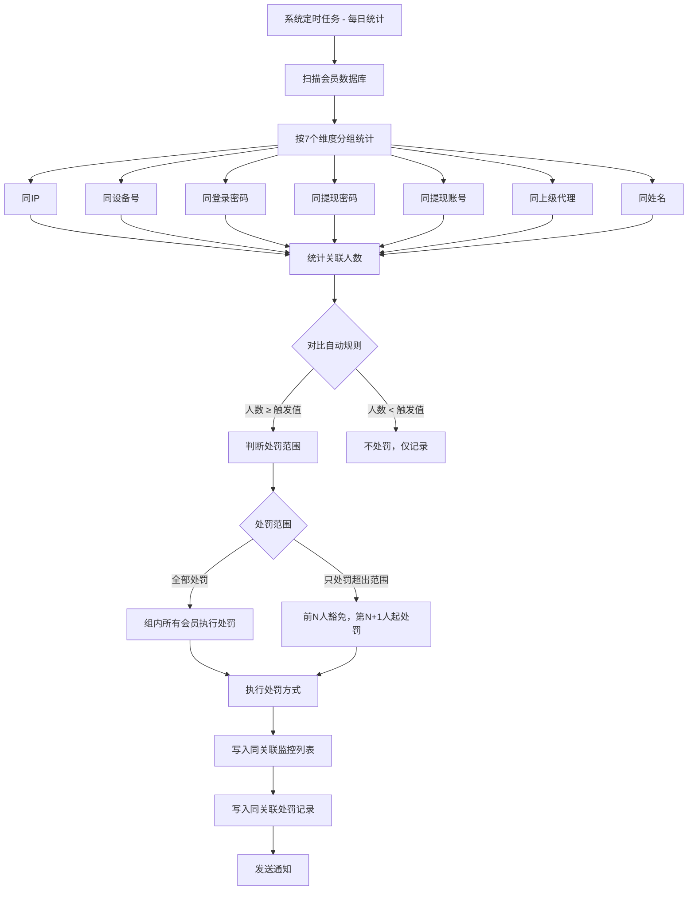

# PRD-022: 同关联监控模块（Association Monitoring Module）

**状态：** 草稿  
**日期：** 2026-06-24  
**涉及仓库：** hashrace/platform-api、hashrace/platform-admin-api、hashrace/platform-admin-interface  
**优先级：** P0（高）  
**作者：** bawan

## 1. 文档概览

- **产品名称：** HashRace Platform 风控系统
- **功能名称：** 同关联监控模块（刷子监控）
- **目标：** 通过识别使用相同设备、IP、密码等信息的会员群体，发现并处理刷分、刷优惠等风险行为，支持配置自动处罚规则。

## 2. 业务流程图

## 3. 功能详细需求

### 3.1 同关联监控的业务定义

**什么是同关联：**
多个会员账号使用相同的设备、IP、密码等信息，疑似为同一自然人控制，目的是刷分、刷优惠或洗钱。

**7种关联类型：**
1. **同IP**：登录IP地址相同
2. **同设备号**：设备指纹相同
3. **同登录密码**：登录密码相同（加密后比对）
4. **同提现密码**：提现密码相同
5. **同提现账号**：绑定的提现账号相同
6. **同上级代理**：同一上级代理下的会员
7. **同姓名**：真实姓名相同

### 3.2 自动规则配置

#### 3.2.1 默认自动规则（预设值）

| 关联类型 | 默认触发值 | 默认处罚范围 | 默认处罚方式 |
|---------|----------|------------|------------|
| 同IP | 99人 | 只处罚超出范围 | 正常（不处罚） |
| 同设备号 | 3人 | 只处罚超出范围 | 禁止领取优惠 |
| 同登录密码 | 3人 | 只处罚超出范围 | 加入黑名单 |
| 同提现密码 | 3人 | 只处罚超出范围 | 正常（不处罚） |
| 同姓名 | 3人 | 只处罚超出范围 | 正常（不处罚） |
| 同上级代理 | 99人 | 只处罚超出范围 | 正常（不处罚） |
| 同提现账号 | 3人 | 只处罚超出范围 | 正常（不处罚） |

#### 3.2.2 规则配置说明

**处罚触发值：**
- 范围：2-999999
- 含义：同关联人数达到此值时触发自动处罚
- 示例：设置为3，表示同设备号的会员达到3人时触发

**处罚范围：**
- **全部处罚**：关联组内所有会员都执行处罚
- **只处罚超出范围**：按关联识别时间排序，前N人豁免，第N+1人起处罚

**处罚范围详解（重要）：**

假设触发值N=3，关联组有5人（A、B、C、D、E，按关联识别时间排序）：

| 处罚范围选项 | 处罚对象 | 豁免对象 | 说明 |
|------------|---------|---------|------|
| 全部处罚 | A、B、C、D、E | 无 | 所有会员都处罚 |
| 只处罚超出范围 | D、E | A、B、C | 前3人豁免，第4、5人处罚 |

**设计意图：**
- 保护正常用户（如宿舍、网吧等场景，同IP很正常）
- 只处罚后续加入的可疑账号

**处罚方式：**
- 正常（默认不处罚）
- 禁止领取优惠
- 加入黑名单
- 修改会员层级
- 修改会员标签
- 冻结
- 禁止进入游戏

### 3.3 页面功能设计

#### 3.3.1 同关联监控主界面

**功能定位：** 展示所有关联组的监控数据，支持手动变更规则

**筛选条件：**
- 时间范围切换：日/周/月（默认：日）
- 起始/结束时间：日期时间选择器
- 关联类型：下拉选择
  - 同上级代理 / 同姓名 / 同IP / 同设备号 / 同登录密码 / 同提现密码 / 同提现账号
- 处罚方式：下拉选择
- 具体关联信息：下拉切换
  - 具体关联信息（输入关联值）
  - 同关联人数（输入数值）

**列表字段：**
- [复选框] 用于批量操作
- 统计时间：系统识别该关联组的时间
- 关联类型：同IP / 同设备号 / 同登录密码等
- **具体关联信息**：格式为 `{类型标签}:{关联值}`
  - 示例：`登录IP: 192.168.1.100`
  - 示例：`登录设备号: 889ed97d-de46-4ffb-9ff7-15e3fc2b6439`
  - 关联值黄色高亮显示
  - **原文明文显示，不脱敏**
  - 右侧有 [复制] 图标，点击复制关联值
- 同关联人数：数字（蓝色可点击），支持排序
- 当前处罚方式：当前对该关联组执行的处罚
- 操作：[变更规则▾] 下拉按钮
- 操作时间
- 操作人

**具体关联信息显示规范：**

| 关联类型 | 前缀文案 | 示例值（明文） |
|---------|---------|--------------|
| 同IP | 登录IP: | 192.168.1.100 |
| 同设备号 | 登录设备号: | 889ed97d-de46-4ffb-9ff7-15e3fc2b6439 |
| 同登录密码 | 登录密码: | （哈希值或掩码） |
| 同提现密码 | 提现密码: | （哈希值或掩码） |
| 同提现账号 | 提现账号: | 6222000000000000 |
| 同上级代理 | 上级代理: | agent001 |
| 同姓名 | 真实姓名: | 张三 |

#### 3.3.2 默认自动规则配置

**功能定位：** 配置系统自动处罚的触发规则

**入口：** 列表右上角 "默认自动规则" 按钮

**弹窗标题：** 默认自动规则

**配置表格：**

| 列字段 | 说明 | 格式 | 必填 | 校验 |
|-------|------|------|------|------|
| 关联原因 | 关联类型名称（只读） | 文本 | — | — |
| 处罚触发值 | 同关联人数达到此值时触发 | 数字输入 | 是 | 2-999999 |
| 处罚范围 | 全部处罚 / 只处罚超出范围 | 下拉单选 | 是 | — |
| 处罚方式 | 触发后执行的处罚动作 | 下拉单选 | 是 | — |

**交互说明：**
- 7行，每行对应一个关联类型
- 可同时修改多个关联类型的规则
- 点击"确认"后保存所有修改，立即全局生效

**Toast提示：**
- 保存成功："保存成功"
- 参数异常："请输入整数值" / "请输入有效数值"

#### 3.3.3 同关联人数详情弹窗

**触发方式：** 点击列表的"同关联人数"数字

**弹窗标题：** 同关联人数

**功能说明：** 展示该关联组下所有关联会员的明细信息

**列表字段：**
- [复选框] 用于批量操作
- 关联时间：该会员被识别为关联的时间
- 真实姓名（带标签）
- 顶层代理
- 上级代理
- 账号状态：正常 / 禁止领取优惠 / 冻结
- 会员层级
- 注册时间（支持排序）
- 币种
- 会员ID（带VIP标签，可点击）
- 会员账号（可点击）
- 关联类型
- 具体关联信息（同主列表格式）
- 处罚方式
- 累计充值金额
- 累计提现金额
- 充提差额
- 当前余额
- 利息宝
- 优惠累计领取
- 累计投注
- 累计输赢
- 操作时间
- 操作人

**顶部操作：**
- [导出报表] 按钮：弹出"导出字段列表"子弹窗，勾选字段后导出
- [×] 关闭按钮

**底部批量操作：**
- [全选当前页] 复选框
- 已选择 N 条数据 共 X 条
- [批量操作▾] 下拉菜单：
  - 批量加入黑名单
  - 批量修改会员层级
  - 批量修改会员标签
  - 批量恢复正常
  - 批量禁止领取优惠
  - 批量冻结
  - 批量修改备注
- [关闭] 按钮

#### 3.3.4 变更规则操作

**功能定位：** 对当前关联组手动变更处罚方式

**触发方式：** 点击列表行的 [变更规则▾] 按钮

**下拉选项：**
- 加入黑名单
- 修改会员层级（弹出层级选择）
- 修改会员标签（弹出标签选择）
- 正常（默认不处罚）
- 禁止领取优惠
- 冻结
- 禁止进入游戏

**交互说明：**
- 选择一项后弹出二次确认
- 确认后执行变更
- Toast："变更规则成功"
- 列表刷新

#### 3.3.5 底部批量操作

**前置条件：** 需勾选至少一条数据

**操作选项：**
- 批量加入黑名单
- 批量修改会员层级
- 批量修改会员标签
- 批量恢复正常
- 批量禁止领取优惠
- 批量冻结

**交互说明：**
- 未勾选时按钮置灰，Toast："请先选择数据"
- 勾选后底部显示"已选择 N 条数据 共 X 条"
- 点击操作后弹出二次确认
- 确认后批量执行
- Toast："批量操作成功"

### 3.4 同关联处罚记录页面

**功能定位：** 展示所有被处罚会员的记录明细

**入口：** 风控 > 刷子监控 > 同关联处罚记录（二级页签）

**筛选条件：**
- 全部币种：下拉选择
- 时间类型切换：操作时间（默认）/ 关联时间
- 时间范围切换：日/周/月
- 日期时间范围：起止时间选择器
- 会员账号：下拉切换
  - 会员账号（默认）/ 会员ID / 真实姓名 / 会员标签 / 会员层级 / VIP等级 / 具体关联信息 / 累计充值金额 / 累计提现金额 / 当前余额
- 关联类型：下拉选择
- 处罚方式：下拉选择

**列表字段：**
- [复选框]
- 币种
- 会员ID（可点击）
- 会员账号（会员层级）
- 真实姓名
- 账号状态
- 注册时间（支持排序）
- 累计充值金额 / 累计提现金额（双行显示）
- 充提差额（支持排序）
- 当前余额 / 利息宝（双行显示）
- 优惠累计领取（支持排序）
- 累计投注（支持排序）
- 累计输赢（支持排序）
- 关联时间
- 关联类型
- 具体关联信息
- 备注
- 处罚方式
- 操作时间
- 操作人
- 操作：[恢复正常]

**操作功能：**

**1. 单条恢复正常：**
- 点击 [恢复正常] 按钮
- 弹出二次确认："确认将该会员恢复正常？"
- 确认后执行
- Toast："恢复正常成功"
- 会员状态立即更新

**2. 批量恢复正常：**
- 勾选多条记录
- 底部显示"已选择 N 条数据"
- 点击 [批量恢复正常]
- 弹出二次确认："确认将所选 N 位会员恢复正常？"
- 确认后批量执行
- Toast："批量恢复正常成功"

**3. 导出报表：**
- 点击"导出报表"按钮
- 弹出"导出字段列表"弹窗
- 勾选需要导出的字段
- 确认后异步导出
- Toast："导出成功，请前往「导出下载」页面下载"

### 3.5 业务规则

#### 3.5.1 自动统计与处罚

**规则1：统计机制**
- 系统每日定时任务扫描会员数据库
- 按7个维度分组统计关联人数
- 生成或更新关联组记录

**规则2：自动处罚触发**
- 当关联人数 ≥ 处罚触发值时，自动触发
- 根据"处罚范围"判断豁免和处罚对象
- 根据"处罚方式"执行对应处罚
- 若处罚方式为"正常"，则不执行处罚，仅记录

**规则3：处罚范围语义**
- **全部处罚**：关联组内所有会员都处罚
- **只处罚超出范围**：按关联识别时间正序排序，前N人豁免，第N+1人起处罚
- 关联识别时间：会员首次被识别为该关联组成员的时间

#### 3.5.2 手动变更规则

**规则1：手动变更优先**
- 风控人员可手动变更任一关联组的处罚方式
- 手动变更后立即对该组会员重新计算处罚
- 原有处罚解除，按新规则重新执行

**规则2：规则修改后重算**
- 修改默认自动规则后，系统自动重算所有关联组
- 按新规则重新判定豁免和处罚对象
- 原本被处罚但新规则下应豁免的会员自动恢复正常

#### 3.5.3 处罚记录追溯

**规则1：记录生成**
- 每次执行处罚时，被处罚的会员生成一条处罚记录
- 记录包含处罚时的会员状态、财务数据、关联信息

**规则2：恢复正常**
- 恢复正常后，会员账号状态立即变更
- 记录保留在处罚记录中，不删除（用于追溯）
- 可以多次对同一会员执行处罚和恢复

### 3.6 页面原型设计（UI元素）

#### 页面1：同关联监控列表页

**顶部筛选区：**
- 时间快捷切换：`[日] [周] [月]`
- 日期时间范围：`[起始时间] ~ [结束时间]`
- 关联类型：`[下拉选择]`
- 处罚方式：`[下拉选择]`
- 具体关联信息：`[下拉切换] [输入框]`
- `[搜索] [重置]` 按钮

**右上角功能区：**
- `[默认自动规则]` 按钮（主按钮）
- `[刷新]` 图标

**列表区域：**
- 表头：`[全选]` | 统计时间 | 关联类型 | 具体关联信息 | 同关联人数 | 当前处罚方式 | 操作 | 操作时间 | 操作人
- 具体关联信息字段：
  - 前缀：正常颜色
  - 关联值：黄色高亮
  - 右侧：[复制]图标
- 同关联人数：蓝色可点击，表头有排序图标
- 操作列：`[变更规则 ▾]` 下拉按钮

**底部操作栏：**
- `[全选当前页]` 复选框
- 已选择 N 条数据 共 X 条
- `[批量操作 ▾]` 下拉按钮
- 分页控件

#### 页面2：默认自动规则配置弹窗

**弹窗标题：** 默认自动规则

**表格内容：**
- 列头：关联原因 | 处罚触发值 | 处罚范围 | 处罚方式
- 7行数据，每行可编辑
- 处罚触发值：数字输入框，Placeholder"输入范围2-999999"
- 处罚范围：下拉选择
- 处罚方式：下拉选择

**底部按钮：**
- `[取消]` `[确认]`

#### 页面3：同关联人数详情弹窗

**弹窗标题：** 同关联人数

**顶部操作：**
- `[导出报表]` 按钮
- `[×]` 关闭图标

**列表区域：**
- 多列表格，支持水平滚动
- 会员ID和会员账号可点击
- VIP标签显示（V0、V1、V11等）
- 金额字段：千分位分隔，保留2位小数

**底部操作：**
- `[全选当前页]` 复选框
- 已选择 N 条数据 共 X 条
- `[批量操作 ▾]` 下拉菜单
- `[关闭]` 按钮

#### 页面4：同关联处罚记录列表页

**结构：** 与同关联监控列表页类似

**特殊字段：**
- 金额字段：千分位分隔，2位小数，可为负数
- 账号状态：彩色标签
  - 正常：绿色
  - 冻结：红色
  - 禁止领取优惠：橙色

**操作列：**
- `[恢复正常]` 按钮

## 4. 异常处理与安全策略

| 异常场景 | 处理逻辑 |
|---------|---------|
| 关联统计任务执行失败 | 自动重试3次，仍失败则记录告警日志 |
| 处罚执行时会员状态已变更 | 提示"会员状态已变更，请刷新后重试" |
| 恢复正常时会员状态不一致 | 以会员系统当前状态为准，强制同步 |
| 修改自动规则后重算超时 | 后台异步执行，完成后通知管理员 |
| 批量操作超过上限 | 拦截，提示"单次最多操作200条" |
| 权限不足访问页面 | 跳转403页面，提示"无权限访问" |

## 5. 验收标准（QA）

### 5.1 自动统计与处罚

- [ ] 系统每日自动执行关联统计
- [ ] 7种关联类型都正确识别
- [ ] 关联人数 ≥ 触发值时自动触发处罚
- [ ] "全部处罚"正确处罚所有会员
- [ ] "只处罚超出范围"正确豁免前N人，处罚第N+1人起
- [ ] 处罚方式="正常"时不执行处罚
- [ ] 处罚后写入处罚记录

### 5.2 默认自动规则配置

- [ ] 配置弹窗正确显示7个关联类型
- [ ] 处罚触发值校验2-999999范围
- [ ] 保存后立即全局生效
- [ ] 修改规则后系统自动重算所有关联组

### 5.3 同关联监控列表

- [ ] 筛选条件正常工作
- [ ] 具体关联信息按规范显示（前缀+黄色高亮值）
- [ ] 复制功能正常，Toast"复制成功"
- [ ] 同关联人数可点击，弹出详情弹窗
- [ ] 同关联人数支持排序
- [ ] 变更规则功能正常
- [ ] 批量操作功能正常

### 5.4 同关联人数详情弹窗

- [ ] 正确显示该关联组所有会员
- [ ] 会员ID和会员账号可点击跳转
- [ ] 导出报表功能正常
- [ ] 批量操作功能正常

### 5.5 同关联处罚记录

- [ ] 正确显示所有被处罚会员
- [ ] 金额字段格式正确（千分位、2位小数、负数）
- [ ] 恢复正常功能正常，会员状态立即更新
- [ ] 批量恢复正常功能正常
- [ ] 导出报表功能正常

### 5.6 权限与日志

- [ ] 无权限管理员无法访问页面
- [ ] 所有操作记录日志
- [ ] 日志包含操作人、操作时间、操作内容

---

**文档版本：** v1.0  
**最后更新：** 2026-06-24
