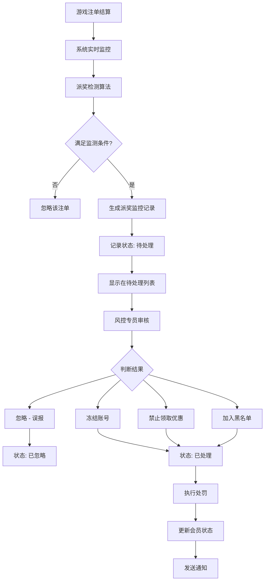

# PRD-023: 派奖监控模块（Prize Distribution Monitoring Module）

**状态：** 草稿  
**日期：** 2026-06-24  
**涉及仓库：** hashrace/platform-api、hashrace/platform-admin-api、hashrace/platform-admin-interface  
**优先级：** P2（中）  
**作者：** bawan

## 1. 文档概览

- **产品名称：** HashRace Platform 风控系统
- **功能名称：** 派奖监控模块
- **目标：** 通过实时监测游戏派奖数据，自动识别异常高额派奖、大额中奖和会员异常获利比，防范游戏漏洞、内外勾结和套利行为。

## 2. 业务流程图



## 3. 功能详细需求

### 3.1 派奖监控的业务定义

**什么是派奖监控：**
识别游戏中的异常高额派奖情况，包括高倍爆奖、大额中奖和会员异常获利比，防范游戏漏洞或内外勾结行为。

### 3.2 监测类型说明

#### 3.2.1 高倍爆奖

**触发条件：**
- 单一注单派奖 / 单局投注 ≥ 设定倍数
- 且单一注单派奖金额 ≥ 设定金额

**计算公式：**
- 倍数 = 单一注单派奖(含本金) / 单局投注
- 统计至个位数后无条件舍去

**默认参数：**
- 高倍爆奖倍数：500 倍
- 高倍爆奖中奖金额：5,000 CNY

**应用场景：**
- 识别老虎机、捕鱼等游戏的超高倍中奖
- 防范游戏漏洞或内外勾结

**示例场景：**
```
游戏: 老虎机-幸运777
会员投注: 10元
派奖金额: 5,200元（含本金）
倍数: 5,200 / 10 = 520倍
判定: 满足条件（520倍 ≥ 500倍 且 5,200元 ≥ 5,000元）
```

#### 3.2.2 大额中奖

**触发条件：**
- 单一注单派奖(不含本金) ≥ 设定金额

**计算公式：**
- 大额中奖 = 派奖金额 - 本金

**默认参数：**
- 大额中奖金额：20,000 CNY

**应用场景：**
- 监控单笔大额派奖
- 防范刷分或套利行为

**示例场景：**
```
游戏: 百家乐
会员投注: 5,000元
派奖金额: 25,000元（含本金）
净盈利: 25,000 - 5,000 = 20,000元
判定: 满足条件（20,000元 ≥ 20,000元）
```

#### 3.2.3 会员获利比

**触发条件：**
- 会员当日游戏盈亏 / 会员当日有效投注 × 100% ≥ 设定百分比
- 且会员当日有效投注 ≥ 触发有效投注值

**计算公式：**
- 获利比 = (会员输赢 / 会员有效投注) × 100%
- 统计至小数点 2 位后无条件舍去

**默认参数：**
- 会员获利比：20.00%
- 获利比触发有效投注值：10,000 CNY

**应用场景：**
- 识别长期高获利会员
- 防范内部测试账号或关联账号刷分

**示例场景：**
```
会员当日数据:
有效投注: 50,000元
盈利: 12,000元
获利比: 12,000 / 50,000 × 100% = 24.00%
判定: 满足条件（24.00% ≥ 20.00% 且 50,000元 ≥ 10,000元）
```

### 3.3 自动检测机制

**检测频率：** 实时监控

**检测流程：**
1. 系统实时监控游戏结算数据
2. 每个注单结算后立即校验是否满足监测条件
3. 满足任一监测类型条件则生成派奖监控记录
4. 记录状态为"待处理"

**数据来源：** 游戏平台的注单系统（已结算注单）

### 3.4 页面功能设计

#### 3.4.1 待处理页签

**功能定位：** 展示所有新检测到的、尚未审核的派奖告警

**筛选条件：**
- 时间维度切换：日/周/月（默认：日）
- 起始/结束时间：日期时间选择器
- 币种：下拉选择（CNY、USD、USDT等）
- 会员查询类型：会员账号/会员ID/登录IP/注册来源
- 会员账号/会员ID：文本输入（精准查询）
- 监测类型：全部类型/高倍爆奖/大额中奖/会员获利比

**列表字段：**
- 币种
- 会员ID（可点击跳转）
- 会员账号（可点击跳转）
- 会员状态：正常/禁止领取优惠/黑名单/冻结
- 登录IP（含归属地）
- 注册来源
- 监测类型：高倍爆奖/大额中奖/会员获利比
- 实际参数：根据监测类型显示对应数值
  - 高倍爆奖：XX 倍
  - 大额中奖：XX.XX CNY
  - 会员获利比：XX.XX%
- 注单编号
- 触发时间
- 状态：待处理（橙色标签）
- 备注：空
- 操作：[处理] [详情]

**单条处理操作：**
1. 点击 [处理] 按钮
2. 弹出处理弹窗
3. 选择处理类型：
   - **忽略**：标记为误报，不执行处罚
   - **冻结**：账号冻结，无法登录
   - **禁止领取优惠**：不能参与优惠活动
   - **加入黑名单**：最严格限制
4. 填写备注（选填，0-500字符）
5. 确认后执行

**批量处理操作：**
1. 勾选多条记录
2. 点击底部 [批量操作▾]
3. 选择"批量处理"
4. 统一选择处理类型、备注
5. 确认后批量执行

**详情查看：**
点击 [详情] 查看完整注单信息（只读）：
- 会员账号
- 注单编号
- 牌局编号
- 子游戏名称
- 结算状态
- 投注时间
- 有效投注
- 玩家输赢
- 结算时间
- 游戏结果（点击查看）

**导出功能：**
- 按当前筛选条件导出所有待处理记录
- 格式：Excel/CSV

**监测参数设置：**
- 配置派奖监测的触发参数
- 入口：待处理页签右上角 "监测参数设置" 按钮

#### 3.4.2 已处理页签

**功能定位：** 展示所有已执行处罚（冻结/禁止优惠/黑名单）的记录

**筛选条件：** 同"待处理"，额外增加：
- 处理结果：下拉选择（全部/冻结/禁止领取优惠/黑名单）
- 操作人：文本输入

**列表字段：** 同"待处理"，额外显示：
- 状态：已处理（蓝色标签）
- 备注：处理时填写的备注
- 处理结果：冻结/禁止领取优惠/黑名单
- 操作人
- 操作时间
- 操作：[修改] [详情]

**修改处理操作：**
1. 点击 [修改] 按钮
2. 可以：
   - 切换处理结果（在冻结/禁止优惠/黑名单之间切换）
   - 修改备注
3. 确认后执行

**注意：** 不支持撤销回待处理（与对赌监控不同）

**批量修改：**
- 支持批量变更处理结果

#### 3.4.3 已忽略页签

**功能定位：** 展示所有标记为误报、不执行处罚的记录

**筛选条件：** 同"已处理"

**列表字段：** 同"已处理"，状态显示为"已忽略"（默认色）

**操作功能：** 同"已处理"

#### 3.4.4 全部页签

**功能定位：** 综合视图，展示所有状态的记录

**筛选条件：** 同"已处理"，额外增加：
- 状态：全部/待处理/已处理/已忽略

**操作功能：**
- 待处理记录：显示 [详情] 按钮
- 已处理/已忽略记录：显示 [详情] 按钮
- 不显示 [处理] 或 [修改] 按钮
- 不支持批量处理

### 3.5 业务规则

#### 3.5.1 自动检测规则

**规则1：数据来源要求**
- 只检测已结算的注单（状态=已结算）
- 实时检测，注单结算后立即校验
- 忽略取消、和局等非正常结算的注单

**规则2：监测类型判定**
- 高倍爆奖：倍数 ≥ 设定值 且 派奖金额 ≥ 设定值
- 大额中奖：净盈利 ≥ 设定值
- 会员获利比：获利比 ≥ 设定百分比 且 有效投注 ≥ 触发值

**规则3：触发阈值可配置**
- 高倍爆奖倍数（默认500倍，可调整）
- 高倍爆奖中奖金额（默认5,000 CNY，可调整）
- 大额中奖金额（默认20,000 CNY，可调整）
- 会员获利比百分比（默认20.00%，可调整）
- 获利比触发有效投注值（默认10,000 CNY，可调整）

#### 3.5.2 人工审核规则

**规则1：处罚执行**
- 忽略：不执行任何处罚，仅标记为已忽略
- 冻结：会员账号立即冻结，无法登录
- 禁止领取优惠：会员无法参与任何优惠活动
- 黑名单：加入会员黑名单，受最严格限制

**规则2：处罚不可逆**
- 已处理记录只能修改处理结果和备注
- 不支持撤销回待处理（与对赌监控不同）
- 设计意图：派奖监控属于高风险告警，需谨慎处理

**规则3：批量操作限制**
- 单次批量处理最多200条记录
- 超过限制需拆分多次操作

#### 3.5.3 通知规则

**会员通知：**
- 站内信：所有处罚必发
- 邮件：若会员已绑定邮箱则发送
- 短信：若处罚类型为"冻结"且已绑定手机号，则发送

**风控人员通知：**
- 待处理数量 > 0 时，发送站内信/邮件提醒
- 提醒频率可配置（每30秒/60秒）

### 3.6 监测参数设置

**功能定位：** 配置派奖监测的触发参数

**入口：** 待处理页签右上角 "监测参数设置" 按钮

**配置项：**

**Tab 1: 派奖监测设置**
- 高倍爆奖倍数：数字输入（默认500倍）
- 高倍爆奖中奖金额：金额输入（默认5,000 CNY）
- 大额中奖金额：金额输入（默认20,000 CNY）
- 会员获利比百分比：百分比输入（默认20.00%）
- 获利比触发有效投注值：金额输入（默认10,000 CNY）

**Tab 2: 风控提醒设置**
- 提醒间隔时间：30秒 / 60秒（默认60秒）
- 提醒方式：站内信/邮件（可多选）

**按钮：**
- `[取消]` `[确认]`

**权限控制：**
- 监测参数设置：仅风控主管和系统管理员可配置
- 配置保存后立即全局生效

### 3.7 页面原型设计（UI元素）

#### 页面1：待处理列表页

**顶部筛选区：**
- 时间快捷切换：`[日] [周] [月]`
- 日期时间范围：`[起始时间] ~ [结束时间]`
- 币种：`[下拉选择] CNY`
- 会员查询类型：`[下拉选择] 会员账号`
- 会员账号/ID：`[输入框]`
- 监测类型：`[下拉选择] 全部类型`
- `[搜索] [重置]` 按钮

**右上角功能区：**
- `[操作教程]` 文字链接
- `[监测参数设置]` 按钮
- `[导出]` 按钮
- `[刷新]` 图标

**列表区域：**
- 表头：币种 | 会员ID | 会员账号 | 会员状态 | 登录IP | 注册来源 | 监测类型 | 实际参数 | 注单编号 | 触发时间 | 状态 | 备注 | 操作
- 监测类型标签：
  - 高倍爆奖：红色
  - 大额中奖：橙色
  - 会员获利比：黄色
- 状态标签：橙色"待处理"
- 操作列：`[处理] [详情]`

**底部操作栏：**
- `[全选当前页]` 复选框
- 已选择 N 条数据 共 X 条
- `[批量操作 ▾]` 下拉按钮
  - 批量处理
  - 批量导出选中
- 分页控件

#### 页面2：处理弹窗

**弹窗标题：** 处理派奖监控

**表单字段：**
- 处理类型（单选下拉）：必选
  - 忽略
  - 冻结
  - 禁止领取优惠
  - 加入黑名单
- 备注（文本域）：选填，0-500字符

**底部按钮：**
- `[取消]` `[确定]` (确定为主按钮)

**交互说明：**
- 处理类型必选
- 点击确定后执行处罚

#### 页面3：详情弹窗

**弹窗标题：** 注单详情

**注单信息区域：**
- 会员账号：player001（可点击跳转）
- 注单编号：20260424100001
- 牌局编号：BJLXXX123456
- 子游戏名称：百家乐
- 结算状态：已结算
- 投注时间：2026-04-24 10:00:00
- 有效投注：5,000.00
- 玩家输赢：20,000.00（正数绿色、负数红色）
- 结算时间：2026-04-24 10:05:00
- 游戏结果：[查看详情]

**监测信息区域：**
- 监测类型：大额中奖
- 实际参数：20,000.00 CNY
- 触发时间：2026-04-24 10:05:01

**底部按钮：**
- `[关闭]`

#### 页面4：监测参数设置弹窗

**弹窗标题：** 监测参数设置

**Tab 1: 派奖监测设置**
- 高倍爆奖倍数：`[数字输入框] 500` 倍
- 高倍爆奖中奖金额：`[金额输入框] 5000.00` CNY
- 大额中奖金额：`[金额输入框] 20000.00` CNY
- 会员获利比百分比：`[百分比输入框] 20.00` %
- 获利比触发有效投注值：`[金额输入框] 10000.00` CNY

**Tab 2: 风控提醒设置**
- 提醒间隔时间：`[单选] ⚫ 60秒 ⚪ 30秒`
- 提醒方式：`[多选] ☑ 站内信 ☑ 邮件`

**底部按钮：**
- `[取消]` `[确认]`

**权限提示：**
- 仅风控主管和系统管理员可修改此配置

## 4. 异常处理与安全策略

| 异常场景 | 处理逻辑 |
|---------|---------|
| 注单数据同步延迟 | 系统自动重试，延迟超过5分钟记录告警日志 |
| 检测算法执行异常 | 记录错误日志，跳过该注单，不影响后续检测 |
| 批量处理超过200条 | 前后端拦截，提示"单次最多处理200条，请拆分" |
| 会员已被其他操作冻结 | 处罚时检测会员状态，若已冻结则跳过 |
| 处理时会员状态已变更 | 提示"会员状态已变更，请刷新后重试" |
| 权限不足访问页面 | 跳转403页面，提示"无权限访问" |
| 修改监测参数权限不足 | 弹窗提示"仅风控主管和系统管理员可修改" |

## 5. 数据与性能要求

### 5.1 数据量预估

- 日均注单量：约100万条
- 预计派奖告警：日均20-100条
- 数据保留期：派奖记录保留1年，1年后归档

### 5.2 性能要求

- 检测频率：实时检测
- 单次检测时间：< 100ms
- 列表加载时间：< 3秒
- 处罚执行响应时间：< 2秒

### 5.3 监控告警

- 检测任务连续失败3次：发送告警
- 待处理积压超过200条：发送告警
- 处罚执行失败率 > 5%：发送告警

## 6. 验收标准（QA）

### 6.1 自动检测验收

- [ ] 系统实时监控注单结算数据
- [ ] 高倍爆奖满足条件时生成告警
- [ ] 大额中奖满足条件时生成告警
- [ ] 会员获利比满足条件时生成告警
- [ ] 同一注单只生成一条记录（即使满足多个监测类型）
- [ ] 计算公式正确（倍数、获利比精度符合要求）

### 6.2 待处理页签验收

- [ ] 筛选条件正常工作，各字段联动正确
- [ ] 列表正确显示待处理记录
- [ ] 会员ID和会员账号可点击跳转
- [ ] 监测类型标签颜色正确
- [ ] 实际参数根据监测类型正确显示
- [ ] 单条处理功能正常，可选择处理类型
- [ ] 批量处理功能正常，最多支持200条
- [ ] 详情弹窗正确显示完整信息
- [ ] 导出功能正常

### 6.3 已处理/已忽略验收

- [ ] 已处理记录正确显示处理结果、操作人、操作时间
- [ ] 修改处理功能正常，可切换处理结果
- [ ] 不支持撤销回待处理（符合设计）
- [ ] 批量修改功能正常

### 6.4 全部页签验收

- [ ] 显示所有状态的记录
- [ ] 跨状态筛选正常工作
- [ ] 不支持批量处理（符合设计）

### 6.5 处罚执行验收

- [ ] 冻结后会员账号立即无法登录
- [ ] 禁止优惠后会员无法领取优惠
- [ ] 加入黑名单后会员状态正确更新
- [ ] 忽略不执行任何处罚
- [ ] 所有处罚发送站内信通知
- [ ] 冻结且已绑定邮箱/手机时发送邮件/短信

### 6.6 监测参数设置验收

- [ ] 监测参数设置弹窗正常打开
- [ ] 所有参数可正常修改
- [ ] 权限控制生效（非风控主管/系统管理员无法修改）
- [ ] 参数保存后立即全局生效
- [ ] 参数校验正确（数值范围、必填项）

### 6.7 权限验收

- [ ] 无"派奖监控"权限的管理员无法访问页面
- [ ] 无"处理"权限的管理员看不到处理按钮
- [ ] 无"批量操作"权限的管理员看不到批量操作按钮
- [ ] 所有操作记录日志

---

**文档版本：** v1.0  
**最后更新：** 2026-06-24
